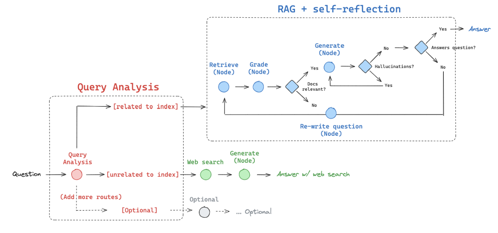
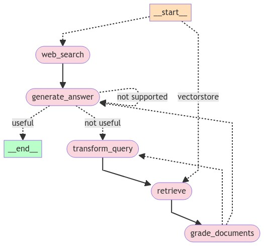
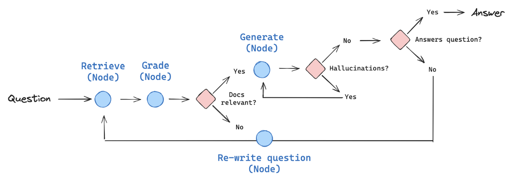
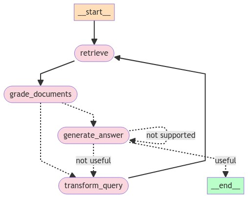

# Adaptive-RAG

Build a RAG to search if topics are not available and to self-correct after its generation

RAG will route between:

- Web search: for questions related to recent events
- Self-corrective RAG: for questions related to our index

# Self-Corrective RAG

- Step 1 - Retrieve: Given the query question, retrieve documents from VectorDB
- Step 2 - Grade Documents: After the documents are retrieved, grade each document to check relevancy. If relevant, add to filtered documents
- Step 3 - Transform Query: If documents are not relevent, rewrite the question
- Step 4 - Generate Answer: If documents are relevent, generate answer
- Step 5 - Grade Answer: Check the answer is hallucination and Check if the answer addresses the question
- Step 6 - Generate Answer: If answer is useful, end. If not useful, rewrite the query. If not supported, re-generate the answer

### In order to avoid infinite loop, use human interruption to update state and forced to change the route
